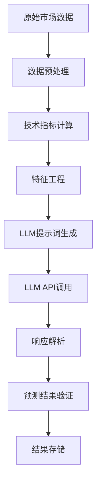
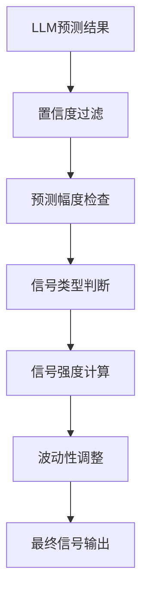
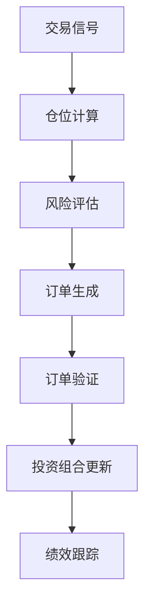

# 📚 AI交易系统术语与算法文档

## 📖 目录

- [核心术语](#核心术语)
- [技术指标详解](#技术指标详解)
- [核心数据结构](#核心数据结构)
- [核心算法](#核心算法)
- [LLM预测流程](#llm预测流程)
- [信号生成算法](#信号生成算法)
- [投资组合管理](#投资组合管理)

---

## 核心术语

### 🤖 AI/ML术语

| 术语 | 英文 | 解释 |
|------|------|------|
| **LLM** | Large Language Model | 大语言模型，如GPT-4、Claude等 |
| **预测置信度** | Prediction Confidence | AI对预测结果的确信程度(0-1) |
| **信号强度** | Signal Strength | 交易信号的强弱程度(0-1) |
| **风险评分** | Risk Score | 交易风险的综合评估分数 |
| **特征工程** | Feature Engineering | 从原始数据中提取有用特征的过程 |

### 📊 技术分析术语

| 术语 | 英文 | 解释 |
|------|------|------|
| **RSI** | Relative Strength Index | 相对强弱指数，衡量超买超卖状态 |
| **MACD** | Moving Average Convergence Divergence | 指数平滑移动平均线 |
| **布林带** | Bollinger Bands | 基于标准差的动态支撑阻力带 |
| **随机振荡器** | Stochastic Oscillator | 衡量收盘价在高低价区间的位置 |
| **威廉指标** | Williams %R | 反向随机指标，衡量超买超卖 |
| **ATR** | Average True Range | 平均真实波幅，衡量价格波动性 |

### 💼 投资组合术语

| 术语 | 英文 | 解释 |
|------|------|------|
| **仓位** | Position | 持有的股票数量和价值 |
| **现金** | Cash | 可用于投资的现金余额 |
| **未实现盈亏** | Unrealized P&L | 持仓的浮动盈亏 |
| **仓位权重** | Position Weight | 单个仓位占总资产的比例 |
| **最大仓位限制** | Max Position Size | 单个仓位的最大允许比例 |

---

## 技术指标详解

### 📈 趋势指标

#### 1. 移动平均线 (Moving Averages)
```python
# 计算公式
MA(n) = (P1 + P2 + ... + Pn) / n

# 系统使用的周期
MA_PERIODS = [5, 10, 20, 50, 200]
```

**用途**: 识别价格趋势方向
- **MA5**: 短期趋势
- **MA20**: 中期趋势  
- **MA50**: 长期趋势
- **MA200**: 超长期趋势

#### 2. MACD (指数平滑移动平均线)
```python
# 计算公式
EMA(12) = 12日指数移动平均
EMA(26) = 26日指数移动平均
MACD = EMA(12) - EMA(26)
Signal = MACD的9日EMA
Histogram = MACD - Signal
```

**用途**: 识别趋势变化和动量
- **MACD > 0**: 上升趋势
- **MACD < 0**: 下降趋势
- **金叉**: MACD上穿Signal，买入信号
- **死叉**: MACD下穿Signal，卖出信号

### 📊 震荡指标

#### 1. RSI (相对强弱指数)
```python
# 计算公式
RSI = 100 - (100 / (1 + RS))
RS = 平均涨幅 / 平均跌幅
```

**用途**: 识别超买超卖状态
- **RSI > 70**: 超买，可能回调
- **RSI < 30**: 超卖，可能反弹
- **RSI 50**: 中性区域

#### 2. 布林带 (Bollinger Bands)
```python
# 计算公式
中轨 = 20日移动平均
上轨 = 中轨 + (2 × 标准差)
下轨 = 中轨 - (2 × 标准差)
带宽 = (上轨 - 下轨) / 中轨
位置 = (价格 - 下轨) / (上轨 - 下轨)
```

**用途**: 识别价格波动范围和突破
- **价格触及上轨**: 可能超买
- **价格触及下轨**: 可能超卖
- **带宽收窄**: 波动性降低，可能突破

#### 3. 随机振荡器 (Stochastic)
```python
# 计算公式
%K = 100 × (收盘价 - 最低价) / (最高价 - 最低价)
%D = %K的3日移动平均
```

**用途**: 识别超买超卖和背离
- **%K > 80**: 超买
- **%K < 20**: 超卖
- **金叉**: %K上穿%D
- **死叉**: %K下穿%D

### 📈 成交量指标

#### 1. 成交量移动平均
```python
# 计算公式
Volume_MA = 20日成交量移动平均
Volume_Ratio = 当日成交量 / Volume_MA
```

**用途**: 分析成交量变化
- **Volume_Ratio > 1**: 成交量放大
- **Volume_Ratio < 1**: 成交量萎缩

#### 2. 价格-成交量关系
```python
# 价格指标
Returns = 日收益率
Log_Returns = 对数收益率
Volatility = 收益率标准差
```

---

## 核心数据结构

### 📊 市场数据结构

```python
# 基础OHLCV数据
{
    "open": float,      # 开盘价
    "high": float,      # 最高价
    "low": float,       # 最低价
    "close": float,     # 收盘价
    "volume": int,      # 成交量
    "date": datetime    # 日期
}
```

### 🤖 LLM预测结果结构

```python
{
    "symbol": str,                    # 股票代码
    "prediction": float,              # 预测涨跌幅(-1.0到1.0)
    "confidence": float,              # 置信度(0.0到1.0)
    "reasoning": str,                 # 预测理由
    "price_target": float,           # 目标价格(可选)
    "timestamp": datetime             # 预测时间
}
```

### 🎯 交易信号结构

```python
{
    "symbol": str,                   # 股票代码
    "signal": str,                    # 信号类型: BUY/SELL/HOLD
    "strength": float,               # 信号强度(0.0到1.0)
    "confidence": float,             # 置信度(0.0到1.0)
    "prediction": float,             # 原始预测值
    "reasoning": str,                # 信号生成理由
    "timestamp": datetime            # 信号生成时间
}
```

### 💼 投资组合结构

```python
{
    "cash": float,                   # 现金余额
    "positions": {                   # 持仓信息
        "SYMBOL": {
            "shares": int,           # 持股数量
            "avg_price": float,      # 平均成本
            "current_price": float,  # 当前价格
            "unrealized_pnl": float  # 未实现盈亏
        }
    },
    "transactions": [                # 交易记录
        {
            "action": str,           # 交易类型: BUY/SELL
            "symbol": str,           # 股票代码
            "quantity": int,         # 交易数量
            "price": float,          # 交易价格
            "timestamp": datetime    # 交易时间
        }
    ],
    "metadata": {                    # 元数据
        "created_at": datetime,
        "updated_at": datetime,
        "initial_cash": float
    }
}
```

### 🎯 订单结构

```python
{
    "symbol": str,                   # 股票代码
    "action": str,                   # 操作: BUY/SELL
    "quantity": int,                # 交易数量
    "estimated_price": float,        # 预估价格
    "estimated_cost": float,         # 预估成本
    "reason": str,                   # 订单理由
    "risk_score": float,            # 风险评分
    "timestamp": datetime           # 订单时间
}
```

---

## 核心算法

### 🧠 LLM预测算法

#### 1. 提示词生成算法
```python
def generate_prediction_prompt(symbol: str, data: pd.DataFrame) -> str:
    """
    生成LLM预测提示词
    
    输入:
        symbol: 股票代码
        data: 包含技术指标的DataFrame
    
    输出:
        格式化的提示词字符串
    """
    # 1. 提取最新数据点
    latest = data.iloc[-1]
    
    # 2. 构建技术分析摘要
    technical_summary = {
        "价格": f"${latest['close']:.2f}",
        "RSI": f"{latest['rsi']:.1f}",
        "MACD": f"{latest['macd']:.4f}",
        "布林带位置": f"{latest['bb_position']:.2f}",
        "成交量比": f"{latest['volume_ratio']:.2f}"
    }
    
    # 3. 生成提示词
    prompt = f"""
    作为专业量化分析师，请分析{symbol}的技术指标：
    
    当前价格: {technical_summary['价格']}
    RSI指标: {technical_summary['RSI']} (超买>70, 超卖<30)
    MACD: {technical_summary['MACD']}
    布林带位置: {technical_summary['布林带位置']} (0-1之间)
    成交量比: {technical_summary['成交量比']}
    
    请预测下一个交易日的价格走势，并提供：
    1. 预测涨跌幅百分比
    2. 置信度(0-100%)
    3. 详细分析理由
    """
    
    return prompt
```

#### 2. 响应解析算法
```python
def parse_llm_response(response: str, symbol: str) -> PredictionResult:
    """
    解析LLM响应为结构化预测结果
    
    输入:
        response: LLM原始响应
        symbol: 股票代码
    
    输出:
        PredictionResult对象
    """
    # 1. 尝试JSON解析
    if response.strip().startswith('{'):
        data = json.loads(response)
        return PredictionResult(
            symbol=symbol,
            prediction=float(data.get('prediction', 0)),
            confidence=float(data.get('confidence', 0.5)),
            reasoning=data.get('reasoning', ''),
            price_target=data.get('price_target')
        )
    
    # 2. 文本解析
    lines = response.strip().split('\n')
    prediction = 0.0
    confidence = 0.5
    reasoning = ''
    
    for line in lines:
        line = line.strip().lower()
        if 'prediction:' in line or 'signal:' in line:
            # 提取预测值
            prediction = extract_percentage(line)
        elif 'confidence:' in line:
            # 提取置信度
            confidence = extract_percentage(line) / 100
        elif 'reasoning:' in line:
            # 提取分析理由
            reasoning = line.split(':', 1)[1].strip()
    
    return PredictionResult(
        symbol=symbol,
        prediction=prediction,
        confidence=confidence,
        reasoning=reasoning
    )
```

### 🎯 信号生成算法

#### 1. 信号强度计算
```python
def calculate_signal_strength(prediction: float, confidence: float) -> Tuple[str, float]:
    """
    计算交易信号强度和类型
    
    输入:
        prediction: LLM预测值(-1.0到1.0)
        confidence: 预测置信度(0.0到1.0)
    
    输出:
        (信号类型, 信号强度)
    """
    # 1. 置信度过滤
    if confidence < MIN_CONFIDENCE:
        return "HOLD", 0.0
    
    # 2. 预测幅度过滤
    abs_prediction = abs(prediction)
    if abs_prediction < SIGNAL_THRESHOLD:
        return "HOLD", abs_prediction
    
    # 3. 信号类型判断
    if prediction > 0:
        signal_type = "BUY"
    else:
        signal_type = "SELL"
    
    # 4. 信号强度计算
    signal_strength = min(abs_prediction * confidence, 1.0)
    
    return signal_type, signal_strength
```

#### 2. 波动性调整算法
```python
def apply_volatility_adjustment(signal_strength: float, volatility: float) -> float:
    """
    根据波动性调整信号强度
    
    输入:
        signal_strength: 原始信号强度
        volatility: 价格波动性
    
    输出:
        调整后的信号强度
    """
    # 高波动性降低信号强度
    if volatility > 0.3:  # 30%以上波动性
        adjustment = 0.7
    elif volatility > 0.2:  # 20-30%波动性
        adjustment = 0.85
    else:  # 低波动性
        adjustment = 1.0
    
    return signal_strength * adjustment
```

### 💼 投资组合管理算法

#### 1. 仓位大小计算
```python
def calculate_position_size(signal_strength: float, confidence: float, 
                          available_cash: float, current_price: float,
                          max_position_size: float = 0.15) -> int:
    """
    计算建议仓位大小
    
    输入:
        signal_strength: 信号强度
        confidence: 置信度
        available_cash: 可用现金
        current_price: 当前价格
        max_position_size: 最大仓位比例
    
    输出:
        建议购买股数
    """
    # 1. 基础仓位计算
    base_allocation = available_cash * max_position_size
    
    # 2. 信号强度调整
    signal_adjusted = base_allocation * signal_strength
    
    # 3. 置信度调整
    confidence_adjusted = signal_adjusted * confidence
    
    # 4. 计算股数
    shares = int(confidence_adjusted / current_price)
    
    # 5. 最小交易限制
    min_trade_value = 1000  # 最小$1000交易
    if shares * current_price < min_trade_value:
        return 0
    
    return shares
```

#### 2. 风险控制算法
```python
def calculate_risk_score(signal_strength: float, confidence: float, 
                        volatility: float, position_size: float) -> float:
    """
    计算交易风险评分
    
    输入:
        signal_strength: 信号强度
        confidence: 置信度
        volatility: 波动性
        position_size: 仓位大小
    
    输出:
        风险评分(0.0-1.0，越低越安全)
    """
    # 1. 基础风险
    base_risk = 1.0 - confidence
    
    # 2. 波动性风险
    volatility_risk = min(volatility * 2, 1.0)
    
    # 3. 仓位风险
    position_risk = min(position_size * 5, 1.0)
    
    # 4. 综合风险评分
    risk_score = (base_risk * 0.4 + volatility_risk * 0.3 + position_risk * 0.3)
    
    return min(risk_score, 1.0)
```

#### 3. 订单验证算法
```python
def validate_order(order: dict, portfolio: dict) -> bool:
    """
    验证订单是否有效
    
    输入:
        order: 订单信息
        portfolio: 投资组合状态
    
    输出:
        订单是否有效
    """
    # 1. 买入订单验证
    if order['action'] == 'BUY':
        # 检查现金是否充足
        if order['estimated_cost'] > portfolio['cash']:
            return False
        
        # 检查仓位限制
        current_positions = len(portfolio['positions'])
        max_positions = 10
        if current_positions >= max_positions:
            return False
    
    # 2. 卖出订单验证
    elif order['action'] == 'SELL':
        symbol = order['symbol']
        if symbol not in portfolio['positions']:
            return False
        
        # 检查持股数量
        current_shares = portfolio['positions'][symbol]['shares']
        if order['quantity'] > current_shares:
            return False
    
    # 3. 风险评分检查
    if order['risk_score'] > 0.8:  # 高风险订单
        return False
    
    return True
```

---

## LLM预测流程

### 🔄 完整预测流程



### 📊 数据流转过程

1. **数据获取**: 从Yahoo Finance获取OHLCV数据
2. **数据清洗**: 处理缺失值、异常值
3. **技术指标计算**: 计算RSI、MACD、布林带等20+指标
4. **特征工程**: 生成价格比率、波动性等衍生特征
5. **提示词构建**: 将技术数据转换为自然语言描述
6. **LLM推理**: 调用大语言模型进行市场分析
7. **结果解析**: 提取预测值、置信度、分析理由
8. **结果验证**: 检查预测结果的合理性

---

## 信号生成算法

### 🎯 信号生成流程



### 📈 信号强度计算

```python
def generate_trading_signal(prediction: float, confidence: float, 
                          volatility: float) -> dict:
    """
    生成交易信号
    
    输入:
        prediction: LLM预测值
        confidence: 预测置信度
        volatility: 价格波动性
    
    输出:
        交易信号字典
    """
    # 1. 基础信号判断
    if confidence < 0.6:  # 置信度不足
        return {
            "signal": "HOLD",
            "strength": 0.0,
            "confidence": confidence,
            "reason": "置信度不足"
        }
    
    # 2. 预测幅度检查
    abs_prediction = abs(prediction)
    if abs_prediction < 0.02:  # 预测幅度小于2%
        return {
            "signal": "HOLD", 
            "strength": abs_prediction,
            "confidence": confidence,
            "reason": "预测幅度不足"
        }
    
    # 3. 信号类型判断
    if prediction > 0:
        signal_type = "BUY"
    else:
        signal_type = "SELL"
    
    # 4. 信号强度计算
    base_strength = min(abs_prediction * confidence, 1.0)
    
    # 5. 波动性调整
    volatility_adjustment = 1.0 - (volatility * 0.5)
    final_strength = base_strength * volatility_adjustment
    
    return {
        "signal": signal_type,
        "strength": final_strength,
        "confidence": confidence,
        "reason": f"预测{prediction:.2%}, 置信度{confidence:.1%}"
    }
```

---

## 投资组合管理

### 💼 投资组合管理流程



### 📊 关键管理参数

| 参数 | 默认值 | 说明 |
|------|--------|------|
| **初始现金** | $100,000 | 投资组合初始资金 |
| **最大仓位比例** | 15% | 单个股票最大仓位 |
| **最大持仓数量** | 10 | 同时持有的股票数量 |
| **最小交易金额** | $1,000 | 单笔交易最小金额 |
| **风险控制** | 2% | 单笔交易最大风险 |

### 🎯 订单生成算法

```python
def generate_orders(signals: dict, market_data: dict, 
                   portfolio: dict) -> list:
    """
    根据交易信号生成订单
    
    输入:
        signals: 交易信号字典
        market_data: 市场数据
        portfolio: 投资组合状态
    
    输出:
        订单列表
    """
    orders = []
    
    for symbol, signal in signals.items():
        if signal['signal'] == 'HOLD':
            continue
        
        # 获取当前价格
        current_price = market_data[symbol]['close'].iloc[-1]
        
        # 计算建议仓位
        if signal['signal'] == 'BUY':
            # 买入订单
            shares = calculate_buy_shares(
                signal, portfolio, current_price
            )
            if shares > 0:
                orders.append({
                    'symbol': symbol,
                    'action': 'BUY',
                    'quantity': shares,
                    'estimated_price': current_price,
                    'estimated_cost': shares * current_price,
                    'reason': signal['reason'],
                    'risk_score': calculate_risk_score(signal)
                })
        
        elif signal['signal'] == 'SELL':
            # 卖出订单
            if symbol in portfolio['positions']:
                current_shares = portfolio['positions'][symbol]['shares']
                sell_shares = calculate_sell_shares(
                    signal, current_shares
                )
                if sell_shares > 0:
                    orders.append({
                        'symbol': symbol,
                        'action': 'SELL',
                        'quantity': sell_shares,
                        'estimated_price': current_price,
                        'estimated_proceeds': sell_shares * current_price,
                        'reason': signal['reason'],
                        'risk_score': calculate_risk_score(signal)
                    })
    
    return orders
```

---

## 🔧 系统配置参数

### 📊 技术指标参数

```python
# 移动平均线周期
MA_PERIODS = [5, 10, 20, 50, 200]

# RSI参数
RSI_PERIOD = 14

# MACD参数
MACD_FAST = 12
MACD_SLOW = 26
MACD_SIGNAL = 9

# 布林带参数
BOLLINGER_PERIOD = 20
BOLLINGER_STD = 2.0

# 随机振荡器参数
STOCH_K_PERIOD = 14
STOCH_D_PERIOD = 3

# 威廉指标参数
WILLIAMS_R_PERIOD = 14

# ATR参数
ATR_PERIOD = 14
```

### 🤖 LLM配置参数

```python
# API配置
OPENROUTER_BASE_URL = "https://openrouter.ai/api/v1"
DEFAULT_TIMEOUT = 30
DEFAULT_MAX_RETRIES = 3

# 模型参数
DEFAULT_TEMPERATURE = 0.3
DEFAULT_MAX_TOKENS = 500
DEFAULT_MIN_CONFIDENCE = 0.6

# 信号阈值
SIGNAL_THRESHOLD = 0.02  # 2%预测幅度阈值
```

### 💼 投资组合参数

```python
# 投资组合配置
INITIAL_CASH = 100000
MAX_POSITION_SIZE = 0.15  # 15%
MAX_TOTAL_POSITIONS = 10
MIN_TRADE_SIZE = 1000     # $1000
RISK_PER_TRADE = 0.02     # 2%
```

---

## 📈 性能指标

### 🎯 预测性能指标

- **预测准确率**: 预测方向正确的比例
- **置信度校准**: 置信度与实际准确率的相关性
- **信号质量**: 信号强度与后续收益的相关性

### 💰 投资组合绩效指标

- **总收益率**: (期末价值 - 期初价值) / 期初价值
- **年化收益率**: 年化后的收益率
- **最大回撤**: 从峰值到谷底的最大跌幅
- **夏普比率**: 风险调整后的收益率
- **胜率**: 盈利交易占总交易的比例

---

## 🚀 扩展功能

### 🔮 高级特征工程

- **价格模式识别**: 识别头肩顶、双底等技术形态
- **情绪指标**: 结合新闻情感分析
- **宏观经济指标**: 利率、通胀等宏观数据
- **行业轮动**: 不同行业间的资金流动

### 🧠 模型优化

- **集成学习**: 结合多个LLM的预测
- **在线学习**: 根据市场反馈调整模型
- **A/B测试**: 不同策略的对比测试
- **回测框架**: 历史数据验证策略有效性

---

*本文档持续更新，如有疑问请参考源代码或联系开发团队。*
